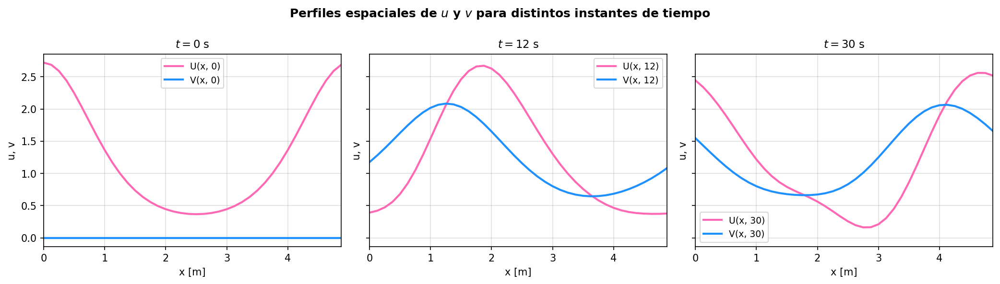
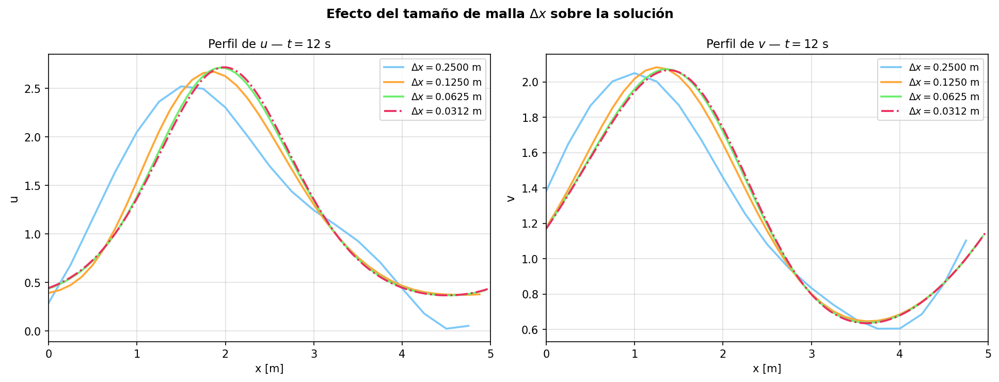
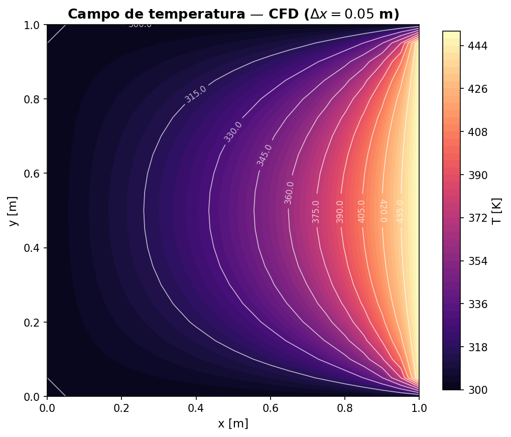
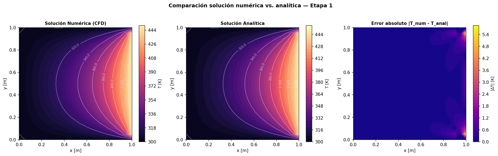
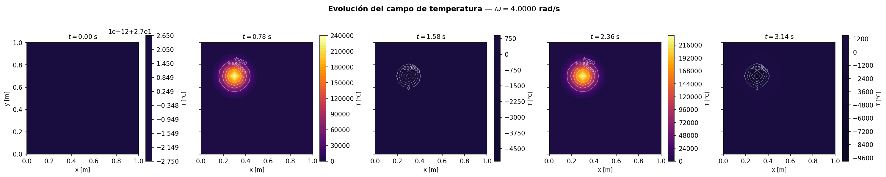
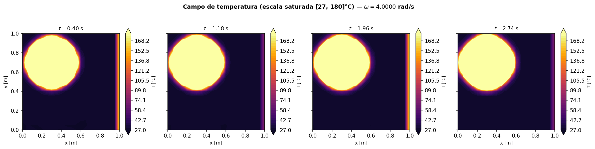
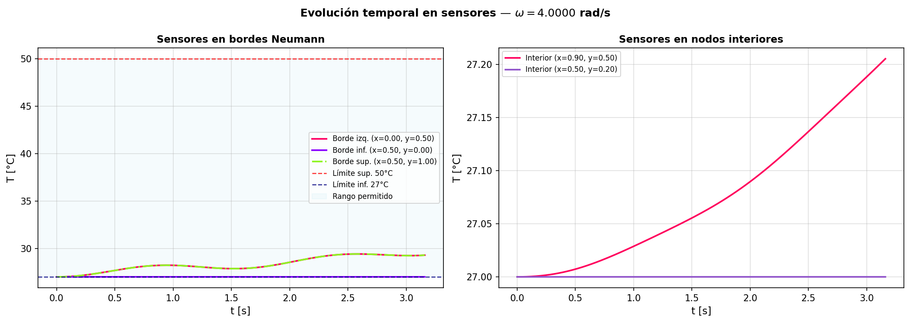

# Taller 02 — Modelación con EDP's
**Modelación Matemática — Universidad Nacional de Colombia**


**Autora:** Andrea Alejandra Suárez Cuervo

---

## Descripción general

Este repositorio contiene el desarrollo completo del Taller 02 de Modelación Matemática, cuyo objetivo es la solución numérica de Ecuaciones Diferenciales Parciales (EDP's) mediante métodos de diferencias finitas. Se abordan dos casos de estudio independientes.

---

## Caso 1 — Ecuación de Transporte Advectivo

Se resuelve numéricamente un sistema acoplado de dos EDP's:

- **u**: cantidad transportada advectivamente a velocidad *c* (ecuación hiperbólica pura)
- **v**: cantidad de relajación que sigue a *u* con tasa γ

### Método
Diferencias Finitas Centradas (CFD) en espacio + Runge-Kutta de cuarto orden (RK4) en tiempo, con condiciones de frontera periódicas implementadas mediante indexación modular.

### **Experimentos realizados:**
- Verificación con parámetros base (réplica de figura del enunciado).
- Efecto del tamaño de malla Δx sobre la solución.
- Efecto del número de Courant CFL = cΔt/Δx sobre la estabilidad.

### **Resultados principales:**



Perfiles de u y v en t=0, 12 y 30 s.



Convergencia con refinamiento de  Δx.

---

## Caso 2 - Conducción de Calor en Placa Rectangular: Etapa 1 — Estado estacionario (validación)

Se resuelve la ecuación de Laplace 2D (∇²T = 0) en una placa rectangular con condiciones Dirichlet en los cuatro bordes. La solución numérica se valida contra la solución analítica exacta obtenida por separación de variables (serie de Fourier).

### Método 

CFD 2D -> sistema lineal pentadiagonal AT=b resuelto
con `scipy.linalg.solve`.

### Resultados principales:



Campo T(x,y) numérico.



Númerico vs. analítico + error.

## Caso 2 - Conducción de Calor en Placa Rectangular: Etapa 2 — Transitorio con fuente interna

Se resuelve la ecuación de calor 2D transitoria con una fuente gaussiana oscilante G(x,y,t) y condiciones de frontera mixtas (Neumann en tres bordes, Dirichlet oscilante en el borde derecho).
Se determina la frecuencia ω que mantiene la temperatura promedio en los bordes Neumann dentro del rango [27°C, 50°C].

### Método

Crank-Nicolson 2D (semi-implícito, incondicionalmente estable). Condiciones de Neumann implementadas con nodos fantasma.

### Resultados principales:



Campo T(x,y,t) en escala automática.



Campo con escala saturada, para una mejor visualización del efecto del borde derecho.



Evolución temporal en 5 sensores.

---


## Cómo ejecutar

Cada caso tiene su propio script principal. Desde la carpeta
correspondiente:

```bash
# Caso 1
cd caso_1
python main.py

# Caso 2 - Etapa 1
cd caso_2
python main.py

# Caso 2 - Etapa 2
cd caso_2
python main.py
```

**Dependencias:** `numpy`, `scipy`, `matplotlib`

```bash
pip install numpy scipy matplotlib
```

---

## Referencias

- LeVeque, R. J. (2002). *Finite Volume Methods for Hyperbolic Problems*. Cambridge University Press.
- Chapra, S. C. & Canale, R. P. (2010). *Numerical Methods for Engineers*. McGraw-Hill.
- Incropera, F. P. et al. (2007). *Fundamentals of Heat and Mass Transfer*. Wiley.
- Salsa, S. (2016). *Partial Differential Equations in Action*. Springer.
- Schiesser, W. E. (1991). *The Numerical Method of Lines*. Academic Press.
